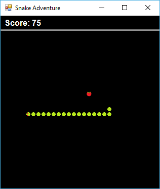

# Snake Adventure
An attempt at creating a clone of the classic Snake game

So I recently found a backup hard drive with some old projects of mine when I was an aspiring developer. I found this little game I developed trying to recreate and improve on the classic snake type of game. This was a good reminder that my journey into this industry was actually inspired by video games and my initial aspirations were to be a Game Designer/Developer.

I thought I would just share this project with the world to show where I am coming from and who knows, maybe somebody might find there's a thing or two to learn from this. This is a Windows Forms Project done in C# with Visual Studio. <b>Unfortunately this was a very long time ago and the code is not well documented.</b>

